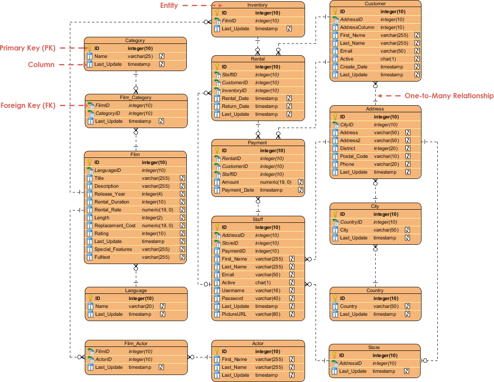
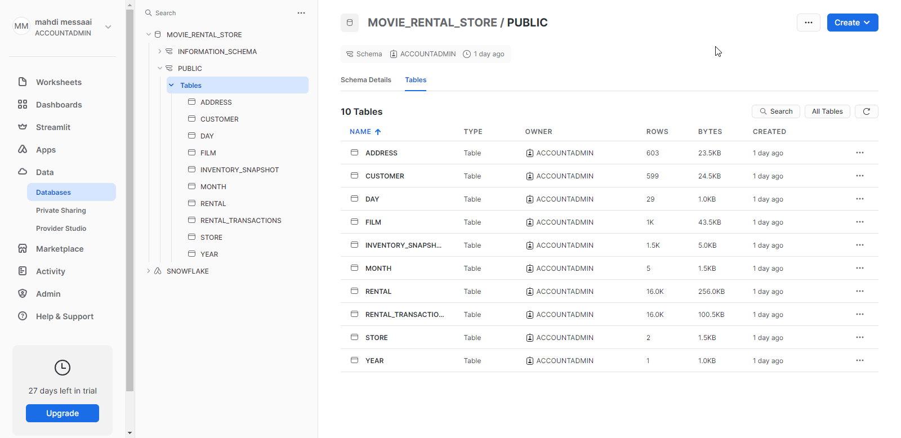
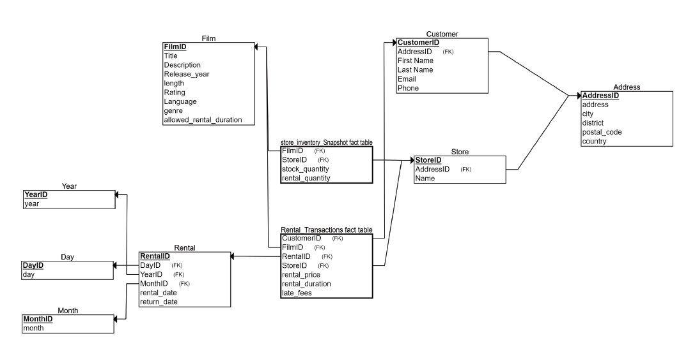
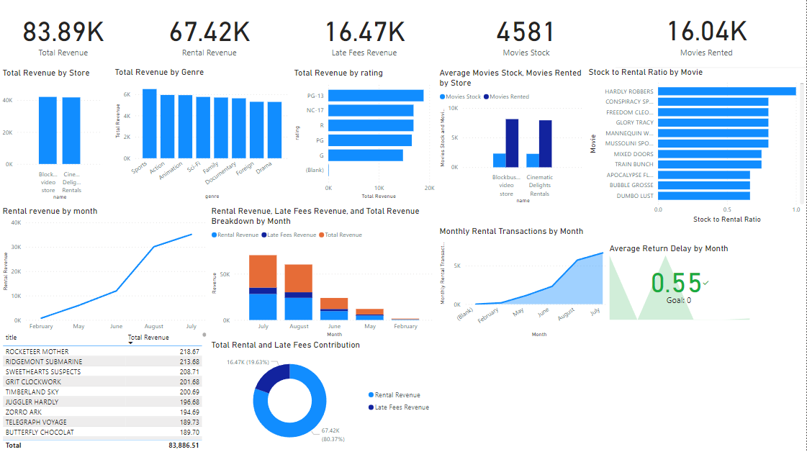

# RentalSight: An Online Movie Rental Warehouse

## Introduction

In the dynamic landscape of online movie rentals, efficient data management is pivotal for success. Introducing RentalSight, a comprehensive data warehouse crafted to empower online movie rental stores with insightful analytics, seamless inventory management, and strategic rental oversight.

## Deliverables

### Revenue Trend Analysis
- Explore revenue trends over specified time periods.
- Visualize revenue patterns based on movie genres or ratings.
- Identify peak revenue periods and potential areas for revenue growth.

### Inventory Management
- Track inventory levels in real-time.
- Identify slow-moving or obsolete inventory for strategic decision-making.
- Measure the efficiency of inventory management and return policy.

### Rental Oversight
- Analyze rental patterns.
- Optimize rental pricing based on demand and historical data.

### User-Friendly Interface
- Intuitive dashboards for easy navigation and quick access to key metrics.
- Customizable reports to tailor insights to specific business requirements.
- Real-time data updates for timely decision-making.

## Data Extraction, Transformation, and Loading (ETL)

### Extraction
Data was extracted from an online dataset comprised of many individual tables in CSV and JSON formats. Original data can be found in the `source_data` folder. The schema for the original database can be seen here.

### Transformation
Data is then transformed using Python and the Pandas library. The following files were used to filter out and transform certain data and save them into CSV files located in the main folder:

- `transform_address.py`: Reads 3 data files in CSV format as pandas dataframes, joins addresses with countries and cities, and saves the output to `address.csv`.
- `transform_film.py`: Reads 4 CSV files, drops unneeded columns, joins each film to the corresponding language and genre, and saves the file.
- `transform_customer.py`: Reads addresses and customer information, removes unneeded columns, joins customers to their addresses, and formats strings in `first_name`, `last_name`, and `email`.
- `transform_rental.py`: Reads in rental information, removes unneeded columns, formats rental date columns, saves day, month, and year information in separate columns, and establishes primary keys.
- `transform_store.py`: Reads in store information, drops unneeded columns, names the two stores, and saves the file.
- `create_inventory_snapshot.py` and `create_rental_transactions.py`: Used to create the two fact tables for analysis. The `ETL.ipynb` notebook executes all transformations, yielding CSV files in the main folder: `address.csv`, `customer.csv`, `store.csv`, `film.csv`, `rental.csv`, `day.csv`, `year.csv`, `month.csv`, `rental_transactions.csv`, `inventory_snapshot.csv`.

### Loading
Data is then loaded onto a Snowflake ROLAP database.

## Data Warehousing

### Store Inventory Snapshot
Used to store historical data on stock and rented quantities by store and movie.

### Rental Transactions
Used to store historical data on all transactions occurring in all stores. Measures include:

- `rental_price`: Price to rent a certain movie.
- `rental_duration`: Actual rental duration of a movie by a customer.
- `late_fees`: Any incurred late return fees (default is $1 per day of delay).

## Dimensions
- Film
- Rental
- Year
- Day
- Month
- Customer
- Store
- Address

## Analysis

Analysis was done using Power BI. Two Power BI files are included in the main folder:

- `snowflake_analysis.pbix`: Gets data from Snowflake directly (requires authentication).
- `local_analysis.pbix`: Uses local files in the folder.

Upon loading up `local_analysis.pbix`, you are introduced to the dashboard.

## Conclusion

- Data quality was not the highest, leading to some disappointing visualizations.
- The project could have been more informative with additional data and dimensions.